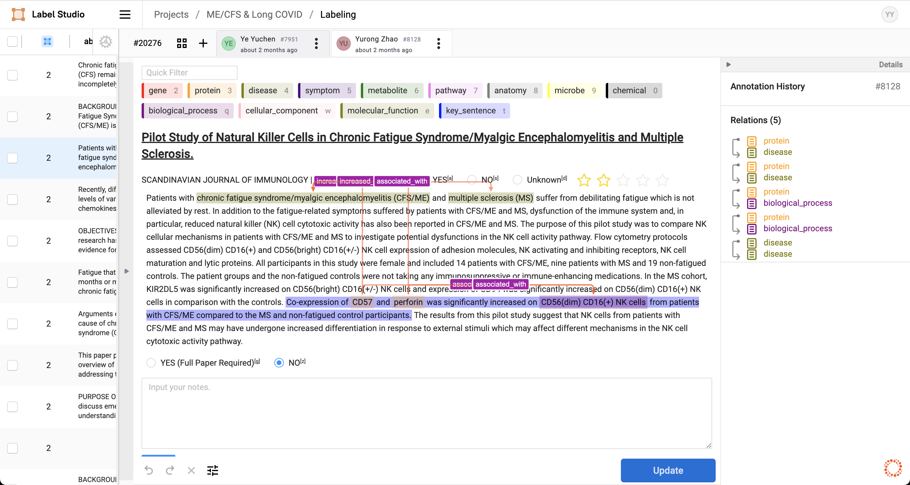

# Hi there 👋

Welcome to the OpenProphetDB! OpenProphetDB is an open research group focused on unlocking the potential of existing drugs to save patients with rare and complex diseases. We explore the following topics: constructing and integrating knowledge graph, multi-omics data, and deep learning models to understand the molecular mechanisms of human rare and complex diseases, or to predict new indications for known drugs through drug repurposing.  Visit our [official website](https://prophetdb.org) for more information.

## Network Medicine Platform for Drug Target & Drug Repurposing

### >>> Online Explorer & Explainer

If you are interested in using knowledge graph and deep learning models to understand the molecular mechanisms of human rare and complex diseases, or to predict new indications for known drugs through drug repurposing. please visit our [Online Explorer & Explainer](https://drugs.3steps.cn/) to get started or the [biomedgps](https://github.com/open-prophetdb/biomedgps) repository to install the web platform locally.

### >>> Building Your Own Knowledge Graph

If you are interested in building your own knowledge graph, please visit the [biomedgps-data](https://github.com/open-prophetdb/biomedgps-data) repository or the [DocWebsite](https://open-prophetdb.github.io/biomedgps-data/).

### >>> Training Your Own GNN Models

If you are interested in training deep learning models based on the knowledge graph, please visit the [biomedgps-model](https://github.com/open-prophetdb/biomedgps-model) repository or the [DocWebsite](https://open-prophetdb.github.io/biomedgps-model/).

### >>> Semi-Auto Labeling Tool for Biomedical Publications

If you want to construct a personalized knowledge graph by labeling any publications, please visit our [Labeling Tool](https://prophet-studio.3steps.cn/) to get started or the [prophet-studio](https://github.com/open-prophetdb/prophet-studio) repository to install the tool locally.

## Insilico Clinical Trials Platform for Validating New Indications

Validating Drug Effects Using EHR and/or Patient Survey Data. Comming Soon...
