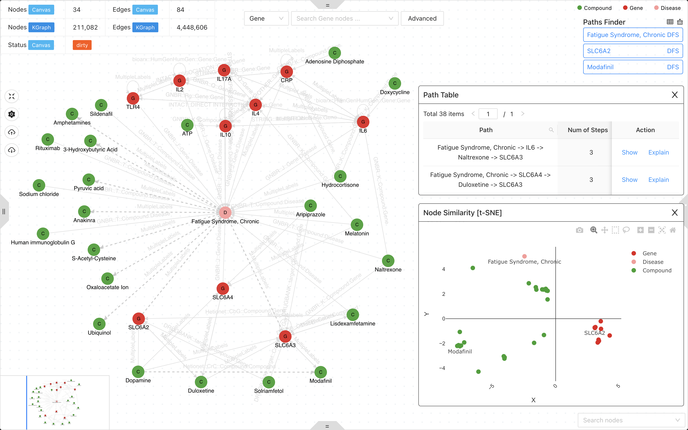

## Hi there 👋

Welcome to the OpenProphetDB! OpenProphetDB is an open research group focused on unlocking the potential of existing drugs to save patients with rare and complex diseases. We explore the following topics: constructing and integrating knowledge graph, multi-omics data, and deep learning models to understand the molecular mechanisms of human rare and complex diseases, or to predict new indications for known drugs through drug repurposing.  Visit our [official website](https://prophetdb.org) for more information.

## Useful Resources

### Network Medicine Platform

If you are interested in using knowledge graph and deep learning models to understand the molecular mechanisms of human diseases or predict known drugs for new indications (Drug Repurposing). please visit our [Network Medicine Platform](https://drugs.3steps.cn/) to get started or the [biomedgps](https://github.com/open-prophetdb/biomedgps) repository to install the platform locally.

### Knowledge Graph & Deep Learning Models

If you are interested in constructing knowledge graph and deep learning models, please visit the [biomedgps-data](https://github.com/open-prophetdb/biomedgps-data) repository or the [DocWebsite](https://open-prophetdb.github.io/biomedgps-data/).

### Labeling Tool for Biomedical Publications

If you want to join us to construct knowledge graph, please visit our [Labeling Tool](https://prophet-studio.3steps.cn/) to get started or the [prophet-studio](https://github.com/open-prophetdb/prophet-studio) repository to install the tool locally.

<!--

**Here are some ideas to get you started:**

🙋‍♀️ A short introduction - what is your organization all about?
🌈 Contribution guidelines - how can the community get involved?
👩‍💻 Useful resources - where can the community find your docs? Is there anything else the community should know?
🍿 Fun facts - what does your team eat for breakfast?
🧙 Remember, you can do mighty things with the power of [Markdown](https://docs.github.com/github/writing-on-github/getting-started-with-writing-and-formatting-on-github/basic-writing-and-formatting-syntax)
-->
